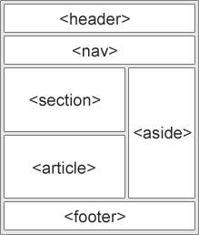
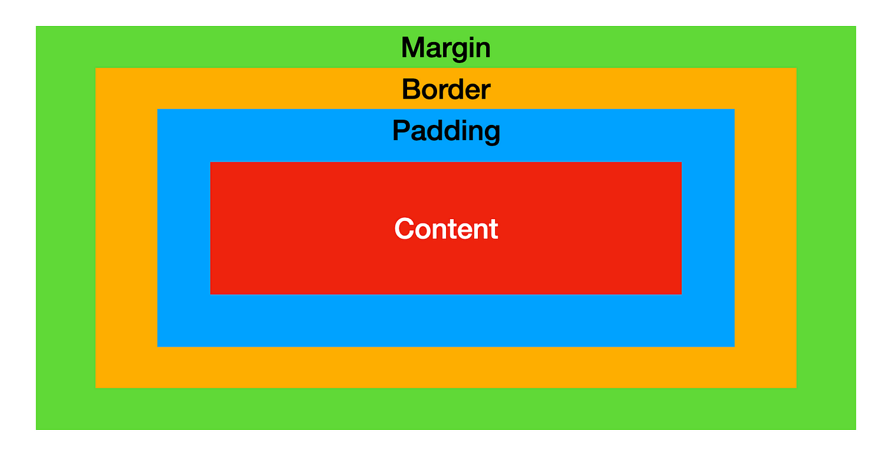

# HTML & CSS Interview Questions

   > Click :star: if you like the project and follow me on LinkedIn [@RameshKumar](https://www.linkedin.com/in/ramesh-kumar-choudhary/) for more updates.


   ## JavaScript Coding Challenges and Interview Question list available here :-

   >1. Click here for [Javascript Quick Asking Coding Interview Questions](https://github.com/rseetech/javascript-quick-coding-interview-questions) more information.
   >  
   >2. Click here for [Javascript Basics Coding](https://github.com/rseetech/javascript-basics) more information.
   >  
   >3. Click here for [Javascript Coding Challenges](https://github.com/rseetech/javascript-coding-challenges) more information.


   ## React Coding Project and Interview Question list available here :-

   >1. Click here for [React Interview Questions & Answers](https://github.com/rseetech/React-interview-questions) more information.
   >
   >2. Click here for [React Routing Axios Search Counter App Using MUI](https://github.com/rseetech/react-routing-axios-search-counter-app-using-mui) more information.
   >
   >3. Click here for [React Routing Pass data Child to Parent](https://github.com/rseetech/react-router-axios-pass-data-child-to-parent) more information.
   >
   >4. Click here for [React Create Tic Tac Toe Game](https://github.com/rseetech/react-create-tic-tac-toe-game) more information.

### Table of Contents

| No. | Questions                                                                              |
| --- | -------------------------------------------------------------------------------------------------------------------------------------------------------------------------------------------------------------- |
| 1   | [What is the difference between HTML and HTML5](#what-is-the-difference-between-html-and-html5)   |
| 2   | [HTML Formatting Elements](#html-formatting-elements)    |
| 3   | [Difference between strong and bold HTML tags are](#difference-between-strong-and-bold-html-tags-are)|
| 4   | [What are Semantic Elements](#what-are-semantic-elements)|            
| 5   | [What is the difference between CSS and CSS3](#what-is-the-difference-between-css-and-css3)|         
| 6   | [What is the CSS Box model and what are its elements](#what-is-the-css-box-model-and-what-are-its-elements)  |          
| 7   | [Explain the difference between visibility hidden and display none](#explain-the-difference-between-visibility-hidden-and-display-none) |
| 8   | [Name all the modules which are used in the current version of CSS](#name-all-the-modules-which-are-used-in-the-current-version-of-css)  |
| 9   | [Write all the properties of flexbox](#write-all-the-properties-of-flexbox)|            
| 10   | [Write all the position states used in CSS](#write-all-the-position-states-used-in-css)|            
| 11  | [Enlist the various fonts attributes](#enlist-the-various-fonts-attributes)|            
| 12   | [What is a Media Query](#what-is-a-media-query)|            

1. ###  What is the difference between HTML and HTML5

    HTML or Hyper-Text Markup Language can be referred to as the World wide Web’s primary language. HTML has  many updates over time, and currently, the newest HTML version is HTML5. Some of the major differences between the two versions are:
        1. HTML5 supports both audio and video whereas none of these was a part of HTML
        2. HTML does not allow JavaScript to run within the web browser whereas HTML5 provides full support for JavaScript to run in the background.
        3. In HTML5, inline MathML and SVG can be used in text whereas this wasn’t possible in HTML.
        4. HTML5 supports new kinds of form controls, for example: dates and times, email, number, range, tel, url, search etc.
        5. There are many new elements introduced in HTML5. Some of the most important ones are: summary, time, audio, details, embed, figcaption, figure, footer, header, article, canvas, nav, output, section, source, track, video, etc..

    **[⬆ Back to Top](#table-of-contents)**

2. ### HTML Formatting Elements

    In the previous chapter, you learned about the HTML style attribute.
    HTML also defines special elements for defining text with a special meaning.
    HTML uses elements like <b> and <i> for formatting output, like bold or italic text.
        Formatting elements were designed to display special types of text:
        1. <b> - Bold text
        2. <strong> - Important text
        3. <i> - Italic text
        4. <em> - Emphasized text
        5. <mark> - Marked text
        6. <small> - Small text
        7. <del> - Deleted text
        8. <ins> - Inserted text
        9. <sub> - Subscript text
        10. <sup> - Superscript text

    **[⬆ Back to Top](#table-of-contents)**

3. ### Difference between strong and bold HTML tags are

    <strong>  - Defines important text
    <b>	    - Defines bold text

    HTML <strong> element defines strong text, with added semantic ‘strong’ importance.
    HTML <b> element defines bold text, without any ‘extra’ importance.

    **[⬆ Back to Top](#table-of-contents)**

4. ### What are Semantic Elements?

    A semantic element clearly describes its meaning to both the browser and the developer.

    Examples of non-semantic elements: <div> and <span> - Tells nothing about its content.
    Examples of semantic elements: <form>, <table>, and <article> - Clearly defines its content.
    
        ```
        <article>
        <aside>
        <details>
        <figcaption>
        <figure>
        <footer>
        <header>
        <main>
        <mark>
        <nav>
        <section>
        <summary>
        <time>

        ```

        

    **[⬆ Back to Top](#table-of-contents)**

## CSS

1. ### What is the difference between CSS and CSS3?

    Cascading Style Sheets, known as "CSS," is a Web design language that is used to control the look and feel of Web pages. The newest version of CSS is CSS3.

    In CSS3, we have new properties like border radius, box shadow, text shadow, multiple background images, gradient , animations, transition, transform etc.

    The main advantages of using CSS3 over any other previous versions of CSS are:

    1. CSS3 is less complex and easy to use as compared to the previous versions of CSS
    2. Browser support has been increased in CSS3.
    3. New concept of modules was introduced for the first time in CSS3.
    4. CSS3 supports responsive design, and can also handle media queries, whereas both the features are not supported in CSS.
    5. CSS3 is much more faster then all of its previous versions.
    6. New colors, including support for RGBA, HSLA, HSL and gradient colors, were added in CSS3.
    7. CSS3 has other added features such as new combinator, new CSS selectors, new pseudo- elements and new style properties.

**[⬆ Back to Top](#table-of-contents)**

2. ### What is the CSS Box model and what are its elements

    The CSS box model is used to define the design and layout of elements of CSS.
    The elements are:

    1. Margin - It removes the area around the border. It is transparent.
    2. Border - It represents the area around the padding
    3. Padding - It removes the area around the content. It is transparent.
    4. Content - It represents the content like text, images, etc.

    
    
    **[⬆ Back to Top](#table-of-contents)**

3. ### Explain the difference between visibility: hidden and display: none

    **visibility:** hidden hides the element, but it occupies space and affects the layout of the document.
    **display:** none also hides the element but not occupy space. It will not affect the layout of the document.

    **[⬆ Back to Top](#table-of-contents)**

4. ### Name all the modules which are used in the current version of CSS

    1. Selectors
    2. Box Model
    3. Backgrounds and Borders
    4. Text Effects
    5. 2D/3D Transformations
    6. Animations
    7. Multiple Column Layout
    8. User Interface.

    **[⬆ Back to Top](#table-of-contents)**

5. ### Write all the properties of flexbox

    Answer: There are several properties of flexbox that are used in the HTML webpage.
    They are:
    1. flex-direction
    2. flex-wrap
    3. flex-flow
    4. justify-content
    5. align-items
    6. align-content

    **[⬆ Back to Top](#table-of-contents)**

6. ### Write all the position states used in CSS

    1. Static(default)
    2. Relative = next to first div.
    3. Fixed
    4. Absolute = overlap 

    **[⬆ Back to Top](#table-of-contents)**

7. ### Enlist the various fonts attributes

    1. Font-style
    2. Font-variant
    3. Font-weight
    4. Font-size/line-height
    5. Font-family
    6. Caption
    7. Icon

    **[⬆ Back to Top](#table-of-contents)**

8. ### What is a Media Query

    Media query is a CSS technique introduced in CSS3.
    It uses the @media rule to include a block of CSS properties only if a certain condition is true.
    
    ** Example: ** If the browser window is 600px or smaller, the background color will be lightblue:
    
        ```
            @media only screen and (max-width: 600px) {
              body {
                background-color: lightblue;
              }
            }
            
        ```

    **[⬆ Back to Top](#table-of-contents)**
